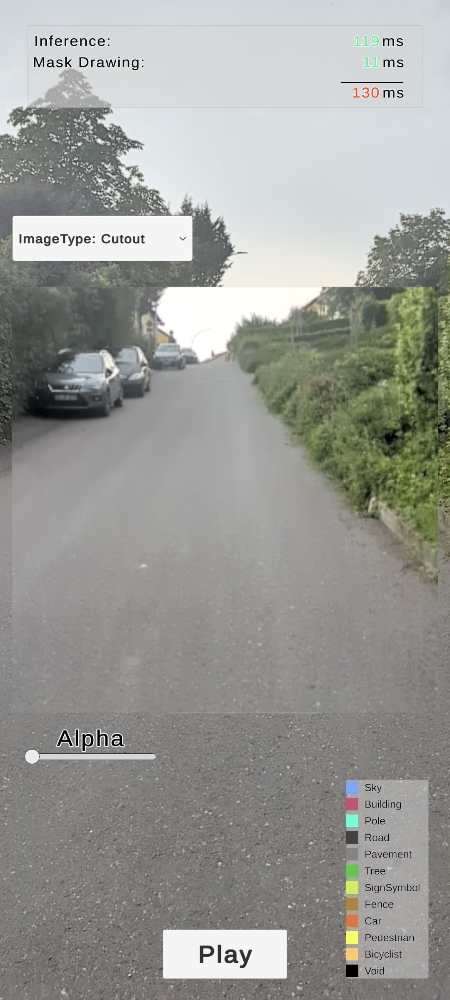
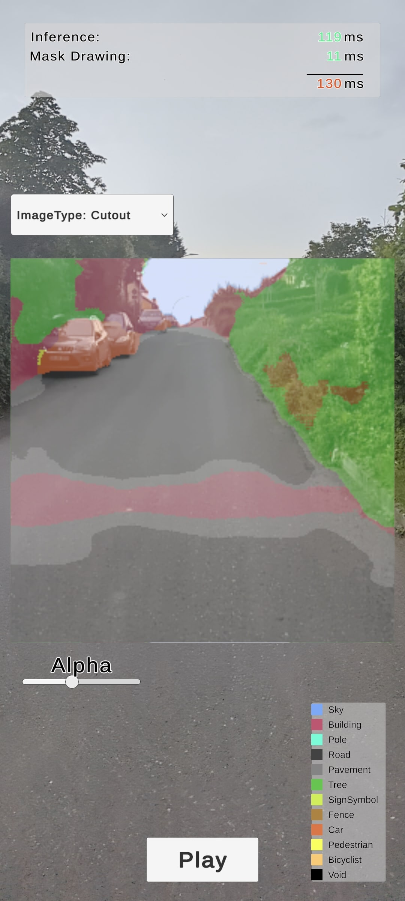
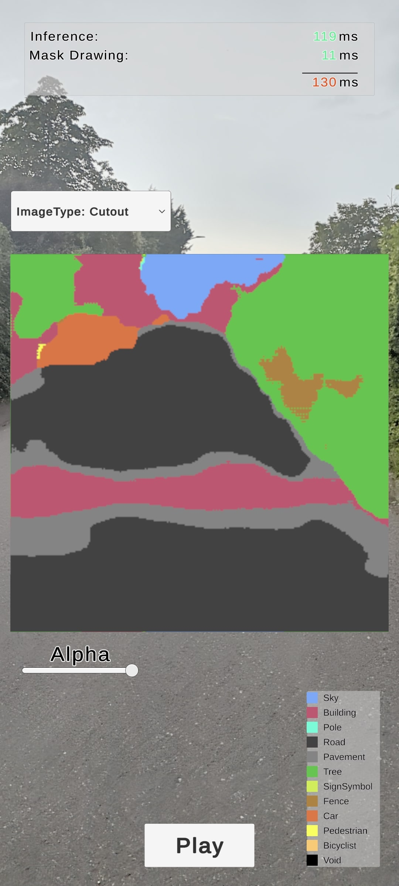

# Unity Semantic Segmentation with Sentis

In this application a semantic segmentation model was created based on the U-Net architecture by Ronneberger et al. (2015). This convolutional neural network was then trained on the the Cambridge-driving Labeled Video Database (CamVid) dataset and then converted into an Open Neural Network Exchange (ONNX) file.

To test the semantic segmentation model in a real environment, a small application was created using Unity and the Sentis library to run inference on a mobile device in real time. This work deploys the trained model inside a smartphone application, where the color images of the camera feed are used as model input to then run inference on device and display the corresponding labeled mask on the display. First the trained model was converted in a Unity compatible format (ONNX format), then the required input in form of a RGB image is acquired by the camera of the device. This image is processed by cutting out a subarea of 256 x 256 pixels, which serves as the model input. This image is then converted into a readable format, a tensor, and then fed through the network to produce class probabilities for each pixel. The model output is then futher processed, where for each pixel, the class with the highest probability is chosen and a corresponding mask showing the predicted labels is created.

  
  
  

  <b>Figure 1:</b> a) Original Image --  
  <b>Figure 2:</b> (b) Predicted Mask --  
  <b>Figure 3:</b> (c) Predicted Mask

## Results and Conclusion
The application demonstrated the ability of this architecture to run in real-time at ~5 FPS, but the visual results indicate that further improvements should be done to train the model for the use in real-world applications. Techniques such as data augmentation or transfer learning should be considered to make the model more robust and enhance the model’s performance.Future work should generally focus on improving accuracy and performance of the model by trying out different approaches, like adding artificial data to the training dataset, testing different model input dimensions, working with weights of pre-trained model’s or even using other model architectures.

## Setup

1. **Download Unity Project**: Download and Open Unity project.
2. **Download Model**: Download `unet_model.onnx` from [this link](https://drive.google.com/file/d/16jKYCE58YCo-wiVtaAJcXqONlxCWwHvg/view?usp=sharing).
3. **Add Model**: Place the downloaded model inside the `/Assets/Models` directory.
4. **Assign Model**: In the Inspector, assign `unet_model.onnx` to the ModelAsset called "unetMini" in the `RunUnet` script.
5. **Build**: Switch to Android Platform and build the Application (use an Android Smartphone)

## Scripts

The main scripts used in this project include:

1. **ModelInput.cs** - Handles input data preparation for the model.
2. **RunUnet.cs** - Manages the execution of the U-Net model for semantic segmentation.
3. **SegmentationController.cs** - Coordinates the segmentation process within Unity.

These scripts can be found in the `Scripts` directory of the project.
> Make sure to assign the downloaded `unet_model.onnx` to the `RunUnet` script as described in the setup instructions.

## Requirements / Versions

- Unity 2023.3.27f
- Sentis 1.5.0

## Tested On

- Pixel 6  -> working
